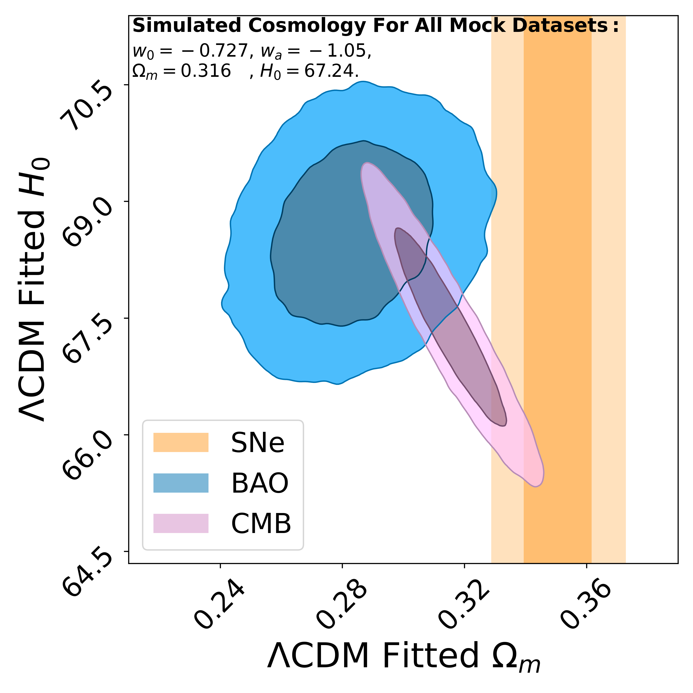

# DM_DE_Signals_in_SNe_BAO_CMB

This repository contains the code and analysis scripts accompanying the paper:

**"Uniting the Observed Dynamical Dark Energy Preference with the Discrepancies in Ωₘ and H₀ Across Cosmological Probes"**  
[arXiv:2412.04430](https://arxiv.org/abs/2412.04430)

The project investigates whether an underlying dynamical dark energy (w₀wₐCDM) cosmology can naturally produce the observed discrepancies in the matter density parameter (Ωₘ) and the Hubble constant (H₀) when individual cosmological probes—Type Ia Supernovae (SNe), Baryon Acoustic Oscillations (BAO), and the Cosmic Microwave Background (CMB)—are analyzed under the ΛCDM framework.

---
<div align="center">
  
</div>

**Figure 3 of [arXiv:2412.04430](https://arxiv.org/abs/2412.04430):** Marginalized ΛCDM fits for **H₀** and **Ωₘ** to mock datasets in *w₀wₐCDM* cosmologies.
- **Left panel:** ΛCDM Ωₘ distributions for SNe, BAO, and CMB. Gray dashed curve: true Ωₘ. Vertical lines: observed Ωₘ values from DESI-Y1 (blue), DES-SN5YR (yellow), and Planck18 (pink).
- **Right panel:** ΛCDM H₀ distributions for BAO and CMB. Gray dashed curve: w₀wₐCDM H₀. Right sub-panel shows ΔH₀ (difference in H₀ between BAO and CMB), with red dashed line as the observed ΔH₀ in data.


---

## Repository Structure

- **notebooks**  
  Jupyter notebooks for:
  - Reproducing all key figures from the paper, including contour and residual plots
  - Step-by-step demonstration of likelihood construction and analysis pipeline

- **data**  
  Directory containing auxiliary data files used in simulations and plotting.

- **scripts** (main directory)  
  Python scripts for:
  - Constructing likelihoods (SNe, BAO, CMB)
  - Running simulations in ΛCDM and w₀wₐCDM cosmologies
  - Performing Fisher matrix and MCMC analysis
  
- (also Appendix F PROFILE LIKELIHOOD TESTS in 'tz_w0wa_profile_minimal_figure10' need [procoli](https://github.com/tkarwal/procoli))

---

#### External Files for Inv or SNe matrix & Appendix B (Figure 5)

For generating **Figure 5** in **Appendix B** of the paper (grid-based exploration of the w₀–wₐ parameter space), please also refer to the following three data files hosted at:

🔗 [Google Drive Folder (SNe matrix Figure 5 files)](https://drive.google.com/drive/folders/1AYAAuGNDkOIizO1JJkExIObTxeTr0zRL?usp=sharing)

- `fw0wacdm_SN+eBOSS+3x2pt.txt`
- `fw0wacdm_planck+SN+eBOSS+3x2pt.txt`
- `fw0wacdm_SN_emcee.txt`
- `inv_cov_matrix_sne.npy`

These files provide precomputed likelihood evaluations and MCMC samples used to generate the blue and orange contours in Figure 5.

---

<table>
  <tr>
    <td style="vertical-align: top; width: 20%;">
      
    </td>
    <td style="vertical-align: top; padding-left: 20px; font-size: 14px;">
      <strong> Figure 1 of arXiv:2412.04430:</strong> Constraints on <strong>Ωₘ</strong> and <strong>H₀</strong> obtained by fitting <em>Λ</em>CDM to mock CMB, BAO, and SNe datasets generated in the DESI+DES-SN+Planck best-fit <em>w₀wₐ</em>CDM cosmology {<em>w₀</em> = –0.727, <em>wₐ</em> = –1.05, <strong>Ωₘ</strong> = 0.316, <strong>H₀</strong> = 67.24}. <br><br>
      The contours represent the 68% and 95% confidence regions for each mock dataset individually: SNe (yellow), BAO (blue), and CMB (pink). This figure illustrates the <strong>Ωₘ</strong> and <strong>H₀</strong> discrepancies between different probes when fitting <em>Λ</em>CDM to data simulated in a dynamical <em>w₀wₐ</em>CDM cosmology.
    </td>
  </tr>
</table>


---

## Dependencies

To run the code, install the following packages:

```
numpy
matplotlib
scipy
joblib
tqdm
pickle
corner
pandas
astropy
chainconsumer
emcee
```

You can install them with:

```bash
pip install numpy matplotlib scipy joblib tqdm pickle corner pandas astropy chainconsumer emcee
```

---

## Citation

If you use this code in your research, please cite:

> Tang, TZ, Brout, D., Karwal, T., Chang, C., Miranda, V., & Vincenzi, M. (2025). *Uniting the Observed Dynamical Dark Energy Preference with the Discrepancies in Ωₘ and H₀ Across Cosmological Probes*. [arXiv:2412.04430](https://arxiv.org/abs/2412.04430).
